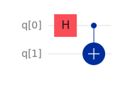

# QuantumCircuits

!!! warning "Disclaimer"
    I want to clarify that this package is not a wrapper around any quantum computing library. It is a standalone package that uses classical computation (`Linear Algebra`) to simulate quantum circuits. More about the mathematics behind the quantum circuits can be found in the [Theory](@ref) section.

## Introduction

`QuantumCircuits` package was developed alongside my [NIUS Project](https://nius.hbcse.tifr.res.in/). This package mainly deals with the classical "[Random Quantum Circuit](https://arxiv.org/abs/2207.14280) simulation."

This package is heavily inspired by the [QuantumInformation.jl](https://iitis.github.io/QuantumInformation.jl/latest/) package. The main difference between the two is that `QuantumCircuits` is more focused on the simulation of quantum circuits. At the same time, `QuantumInformation` is more focused on the mathematical aspects of quantum information theory.

For the time being, this package contains the following features:
* [Random Matrices](@ref "Random Matrices Generation")

    Here, you can generate the following random matrices:
    * Random Unitary
    * Random Hermitian

* [Circuit Utilities](@ref "Quantum Circuit Utils")

    Here, you can find the following utilities:
    * Random State vector
    * Zero State vector for a given number of qubits
    * Check if a given state vector is a valid state vector
    * Fidelity between two state vectors
    * Probability of measuring a state vector on a given basis
    * State vector after a projective measurement
    * Creates a measurement operator for a given basis for a given qubit in a system

* [Circuit Evolution](@ref "Quantum Circuit Time Evolution")

## Theory

!!! tip "Before Read"
    I would assume that you have some basic knowledge of quantum computing. If you don't, I would recommend you to go through the bible of quantum computing, [Quantum Computation and Quantum Information](https://www.cambridge.org/highereducation/books/quantum-computation-and-quantum-information/01E10196D0A682A6AEFFEA52D53BE9AE) by Michael A. Nielsen and Isaac L. Chuang.

To discuss how we simulate Quantum Circuit, lets discuss the mathematics with the example of `Bell State`. Using the standard convention set by [Qiskit](https://ibm.com/quantum/qiskit), lets initialize our quantum circuit composed of two qubits in state ``|00\rangle``. Using following circuit we can create a Bell state from the initial state



So using basic linear algebra representation, we can write,
```math
|0\rangle = \begin{bmatrix} 1 \\ 0 \end{bmatrix} \quad \implies \quad |00\rangle = \begin{bmatrix} 1 \\ 0 \end{bmatrix} \otimes \begin{bmatrix} 1 \\ 0 \end{bmatrix}
```
Here, we can simulate this circuit by representing this circuit as a `unitary matrix`, say ``|\Psi\rangle`` is the final state of the circuit _i.e._
```math
|\Psi\rangle = [CX]~[H \otimes I]~|00\rangle
```
where ``CX`` is the matrix representation of _Controlled NOT_ Gate, and ``H`` is the matrix representation of _Hadamard_ Gate.

In general, these matrices can be combined into a single unitary matrix say ``~\mathcal{U}``, and say our initial state is given by ``|\Psi\rangle``, so after the evolution we have the final state ``|\Phi\rangle``, as
```math
|\Phi\rangle = \mathcal{U} ~ |\Psi\rangle
```

### Magic of Measurements

We can use similar strategy to simulate `projective measurements` as well. Say we have a projection operator ``\Pi``, and we want to do a measurement on the state ``|\Psi\rangle``, so the state after the measurement can be calculated by,
```math
|\Phi\rangle = \frac{ \Pi |\Psi\rangle }{ \langle \Psi | \Pi | \Psi \rangle }
```

## Future Plans

I needed only a few features since I developed this package for my research. I will be adding more features in the future.

!!! note "Things to remember"
    I will add more features in the future.

## Special Thanks

I want to thank my mentor, [Dr. Sambuddha Sanyal](https://www.iisertirupati.ac.in/oldwebsite/faculty/sambuddha/sambuddha.php), for guiding me throughout the project. I would also like to thank [HBCSE](https://www.hbcse.tifr.res.in/) for providing me with this opportunity.
